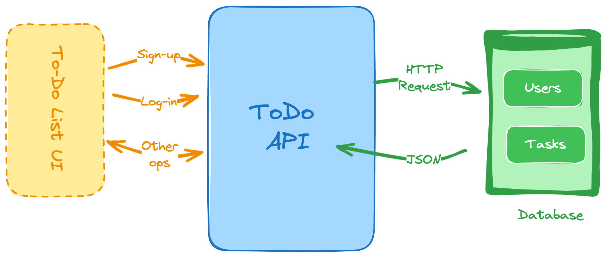

# To-Do Application

This is a To-Do application built using Golang, HTML, CSS, and JavaScript. The backend is powered by the Fiber framework and a PostgreSQL database.

## Features

- User authentication (sign-up and log-in)
- Task creation, updating, deletion
- Task status updates
- Task filtering by status
- Retrieve details of individual tasks

### System Design Diagram



## API Endpoints

### User Authentication

#### Sign-up

- **Endpoint:** `POST /signup`
- **Description:** Register a new user.
- **Request Body:**
    ```json
    {
        "username": "string",
        "password": "string"
    }
    ```
- **Response:**
    ```json
    {
        "message": "User created successfully."
    }
    ```

#### Log-in

- **Endpoint:** `POST /login`
- **Description:** Authenticate a user and return a token.
- **Request Body:**
    ```json
    {
        "username": "string",
        "password": "string"
    }
    ```
- **Response:**
    ```json
    {
        "token": "jwt_token"
    }
    ```

### User Management

#### Get User Details

- **Endpoint:** `GET /users/{userId}`
- **Description:** Retrieve user details by user ID.
- **Request Headers:**
    ```
    Authorization: Bearer jwt_token
    ```
- **Response:**
    ```json
    {
        "userId": "integer",
        "username": "string"
    }
    ```

### Task Management

#### Create Task

- **Endpoint:** `POST /tasks`
- **Description:** Create a new task.
- **Request Headers:**
    ```
    Authorization: Bearer jwt_token
    ```
- **Request Body:**
    ```json
    {
        "title": "string",
        "description": "string",
        "status": "string"  // e.g., "pending", "completed"
    }
    ```
- **Response:**
    ```json
    {
        "taskId": "integer",
        "message": "Task created successfully."
    }
    ```

#### Update Task

- **Endpoint:** `PUT /tasks/{taskId}`
- **Description:** Update an existing task.
- **Request Headers:**
    ```
    Authorization: Bearer jwt_token
    ```
- **Request Body:**
    ```json
    {
        "title": "string",
        "description": "string",
        "status": "string"  // e.g., "pending", "completed"
    }
    ```
- **Response:**
    ```json
    {
        "message": "Task updated successfully."
    }
    ```

#### Delete Task

- **Endpoint:** `DELETE /tasks/{taskId}`
- **Description:** Delete a task by task ID.
- **Request Headers:**
    ```
    Authorization: Bearer jwt_token
    ```
- **Response:**
    ```json
    {
        "message": "Task deleted successfully."
    }
    ```

#### Get Task List

- **Endpoint:** `GET /tasks`
- **Description:** Retrieve a list of tasks with optional filters.
- **Request Headers:**
    ```
    Authorization: Bearer jwt_token
    ```
- **Request Parameters:**
    - `status` (optional): Filter tasks by status (e.g., `pending`, `completed`).
- **Response:**
    ```json
    {
        "tasks": [
            {
                "taskId": "integer",
                "title": "string",
                "description": "string",
                "status": "string",
                "createdAt": "datetime",
                "updatedAt": "datetime"
            },
            ...
        ]
    }
    ```

#### Get Task Details

- **Endpoint:** `GET /tasks/{taskId}`
- **Description:** Retrieve details of a specific task by task ID.
- **Request Headers:**
    ```
    Authorization: Bearer jwt_token
    ```
- **Response:**
    ```json
    {
        "taskId": "integer",
        "title": "string",
        "description": "string",
        "status": "string",
        "createdAt": "datetime",
        "updatedAt": "datetime"
    }
    ```

## Getting Started

### Prerequisites

- Go 1.16 or later
- PostgreSQL
- Fiber framework
- HTML, CSS, JavaScript

### Installation

1. Clone the repository:
    ```sh
    git clone https://github.com/yourusername/todo-app.git
    cd todo-app
    ```

2. Install dependencies:
    ```sh
    go get -u github.com/gofiber/fiber/v2
    go get -u github.com/gofiber/template/html/v2
    go get -u github.com/lib/pq
    ```

3. Set up the PostgreSQL database and update the connection string in the code:
    ```sh
    postgresql://<username>:<password>@<address>/<database_name>?sslmode=disable
    ```

4. Run the application:
    ```sh
    go run server.go
    ```

### Usage

Access the application at [http://localhost:3000](http://localhost:3000).
